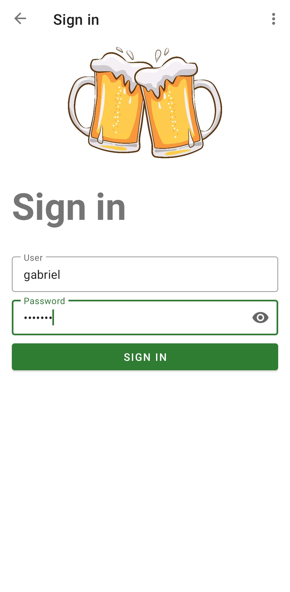
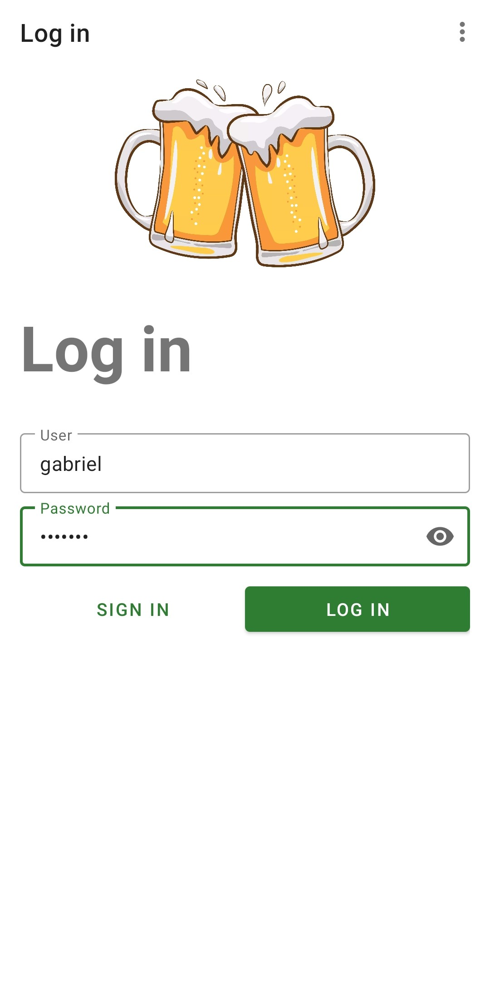
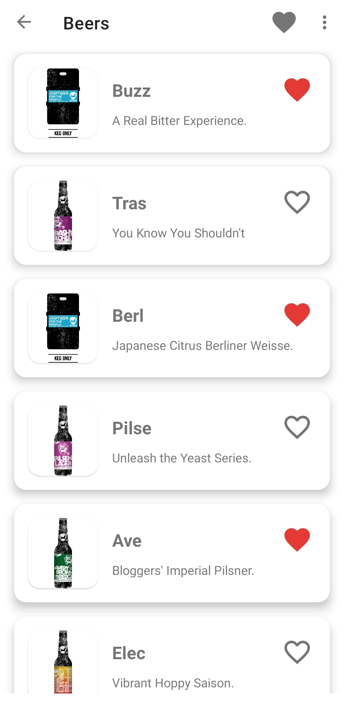
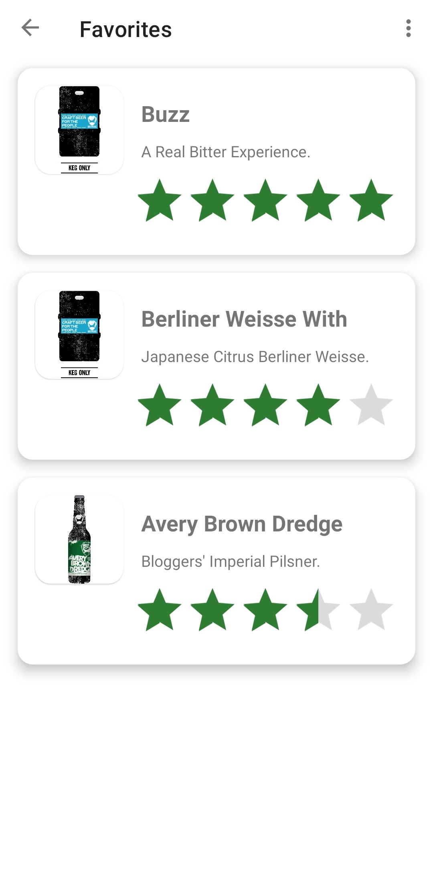
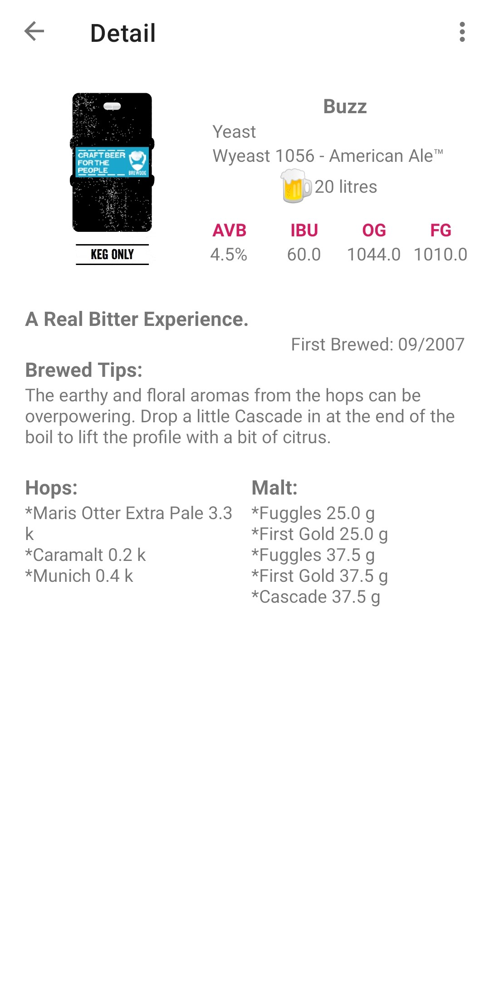

# RetrofitCall Application

## Description


Android application developed in Kotlin programming language with MVVM Arquitecture. It includes the user registration and validation functionality. Provide information from an API **https://api.punkapi.com/v2/beers** using Retrofit and Dependency Injection with Dagger/Hilt. Display a list of beers with basic information. Show detail of a specific beer by clicking on it. Also add beers to the favorites list where you can view it by clicking the favorites icon, within this section the user can rate each of the beers added to favorites using Room library.


## Features

* Create an account
* User validation
* Shows list of beers from API
* Shows detail of a specific beer
* Add beer to favorites list
* Show favorites beer list
* Rating beers from the list of favorites
* Button to exit the application
* Button to Log out

## Technologies

* Kotlin
* Retrofit
* Room
* MVVM
* LiveData
* ViewModel
* Coroutines
* Dagger Hilt
* Material Design
* Extension Functions
* Navigation Component
* Cache Strategy (Repository Pattern)
* Picasso
* Facebook Shimmer
* Data Binding

## Instalation

1. Clone this repository

```
    git clone https://github.com/lizarragabriel/RetrofitCall.git
```

## Screens

<table>
    <tr>
        <td></td>
        <td></td>
        <td></td>
        <td></td>
        <td></td>
    </tr>
</table>